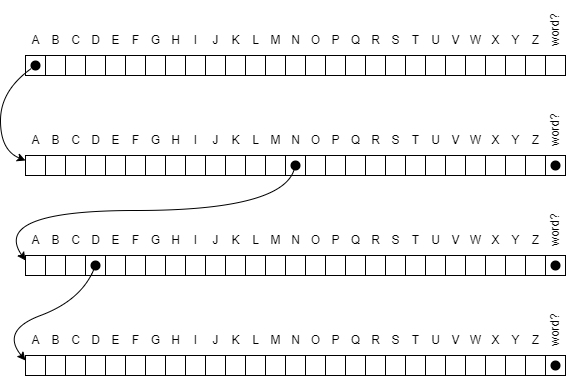

# Trie
The trie (pronounced like "try," even though it is derived from re**trie**val) data structure is a tree structure used for storing strings. Each node in the tree has 26 children, one for each letter of the alphabet. It also contains a flag indicating whether the node is the end of a word.

A trie is efficient for storing strings that have a common prefix. For example, the words A, AN, and AND would be stored in a trie that looks like this:



As a demonstration, I implemented a simple spell checker app. It loads a list of 10,000 words, prints some statistics about the trie, and spell checks Trump's infamous "covfefe" tweet.

The output looks like this:

```
10,000 words in 24,179 nodes
Unknown words:
covfefe
```

Admittedly, my implementation is not very efficient. However, I was more interested in making the code more readable. For example, it recalculates the child index every time it needs it. Also, the leaf node of a trie is always empty, so one optimization is to reuse a static leaf node.
